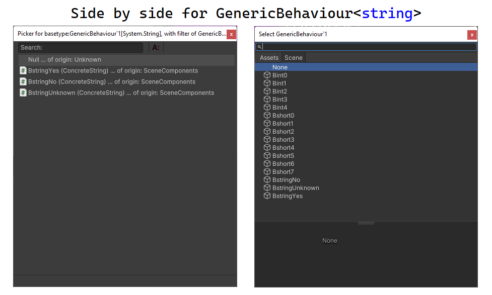

The main reason of making custom picker is a need to distinctly select objects with interfaces:

And generic object field types:

## Custom Picker for attributes

Custom Picker button can appear for: `ValidReferenceAttribute`, `ProvidedComponentAttribute`, and `MarkNullAsColorAttribute`.

1. If there is no suitable selector type or for attribute specific reasons the selector button will not be displayed. If so, the field will just have a monotonous background color.

2. If there is only one picker type available for a property, then in the leftmost part of property will be shown grey button.

3. Because button is usually partially transparent it can appear with slightly different color depending of attribute state.

4. If there are multiply picker types available, then in the bottom part of the picker button small yellow line will appear.
Left click on picker button always opens first type of picker options. 
Right click access them all and open the pop-up picker menu.

5) Although the appearance of the button may change slightly depending on the status of the attribute, the yellow line will always show up if there are multiple types of selectors.
