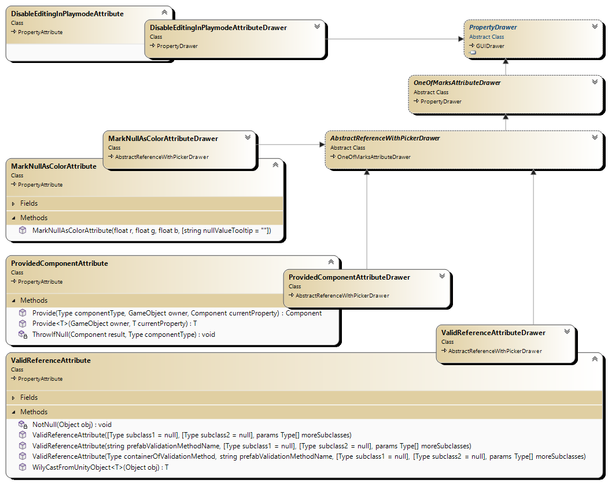

# Attributes:

All UKnack attributes have in most effect in UnityEditor. They act in a way like a contract and therefore have almost no power on the Runtime environment by themselves. While there is a possibility for future additions, all work of attributes are currently located within their property drawers.

The `DisableEditingInPlaymodeAttribute` can be applied to any attribute but only once.

`ValidReferenceAttribute`, `ProvidedComponentAttribute`, and `MarkNullAsColorAttribute` each have their own drawer with a common parent class called OneOfMarksAttributeDrawer. This means they share certain characteristics. Each has a restriction that only one of them or an attribute that inherits from them can be used in a property. These attributes can only be applied to objects that have `UnityEngine.Object` as their parent. 

However, if applied to the broad UnityEngine.Object type without any narrowing, the custom picker will not be shown.
 There are two reasons for this: firstly, the standard picker is already optimized for pure `UnityEngine.Objects`, and secondly, because of the abundance of objects in the editor, the UI toolkit List struggles to display them all.

### [Info about picker](Attributes-Picker)

### DisableEditingInPlaymodeAttribute
This is the simplest attribute - all it does is disable editing in the editor for the applied field when Playmode is started. It was tested and should work with all other attributes from this library, including most standard attributes and field types.

### ValidReferenceAttribute
Is the most complex attribute in this library at the moment. Checks that field is not null. If applicable, and no additional picker types provided custom picker for current field type added. 

[Valid Reference] - is a default application of the attribute.

[Valid Reference (string name of the static method)] - in this form static method of current field owner object used to validate the field value.

[Valid Reference (type of static method's owner, string name of the static method)] - in this form static method of provided type used to validate the field value.

Additionally to these forms, any reasonable number of types can be added after these forms, which will be used to add custom pickers if provided type is applicable.
A form of [ValidReference (typeof (ITest))] adds custom picker for ITest interface that is applied as filter finding objects of field type.
Attribute able to differentiate what is the type of validate method and what is typed for the picker, because the string name of the static validation method is acting as a separator.
As a requirement for static method - is that it should be able to take at least field type. For more complex applications of validate attribute, see provided with package examples.

### ProvidedComponentAttribute
Provided component is contract type of attributes that serve similar cause as Unity RequireComponentAttribute, but unlike the one in Unity it does not actually specify how object should be provided.
If field reference is Null, then it shows color filled cover in place of field and custom picker button. RequireComponentAttribute class has static methods that can actually help to get provided field.
Provide method of attribute will be taken not null value from field, then it will get it by GetComponentInParent method - first searched gameobject, then its parents up the game object chain.

If the field is Null and no Components found up the chain, then the color of field will be changed to red, and a tooltip will contain an error message.

### MarkNullAsColorAttribute
Will just add a custom picker if applicable, and draw background of field with color for Null. It can be used as blank for user attributes.
